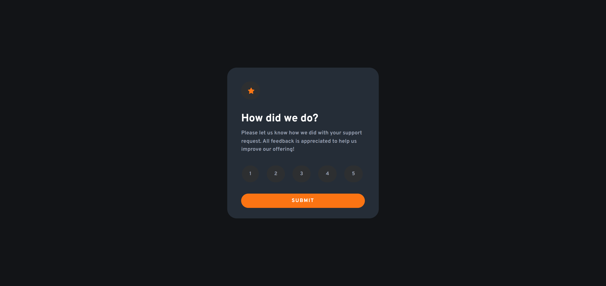
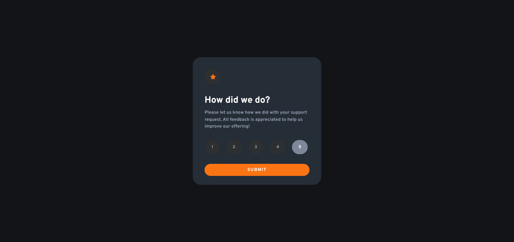
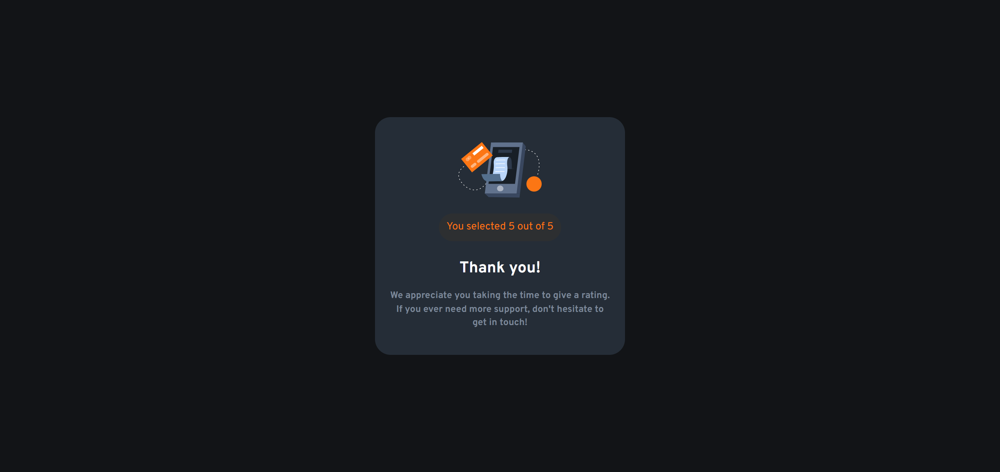
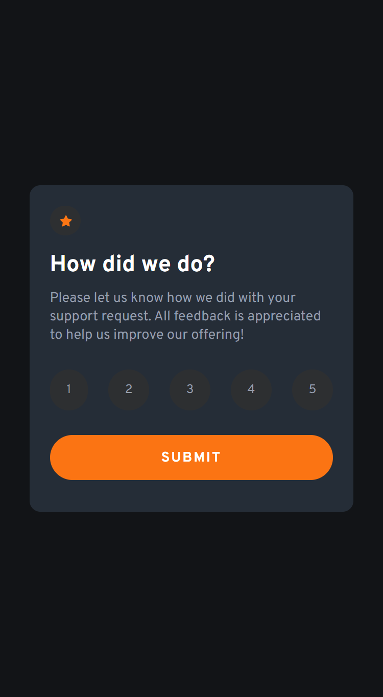
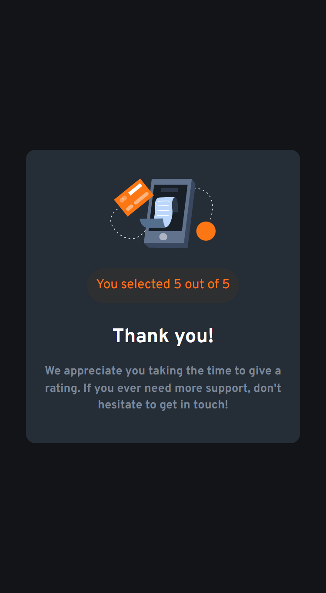

# Frontend Mentor - Product preview card component

## Welcome! 👋

This is the second Front End Mentor challenge I'm doing, I hope I can finish one every day!

For this challenge I used **HTML**, **CSS** and **JavaScript**.

I managed to use the same practices as in the first challenge 
but I completely forgot how to keep the color on the sort buttons, 
turns out I just had to use the ``:focus`` pseudo-class.

I spent a long time trying to do it from the DOM, when I only needed to change one property. 

But it pays to get caught up in the small stuff, because the joy of fixing something is the best part.

## Screenshots 🤨📷

Here are some screenshots of the final result for the 1440px and 375px widths respectively.

### Desktop 1440px

### Mobile 375px

